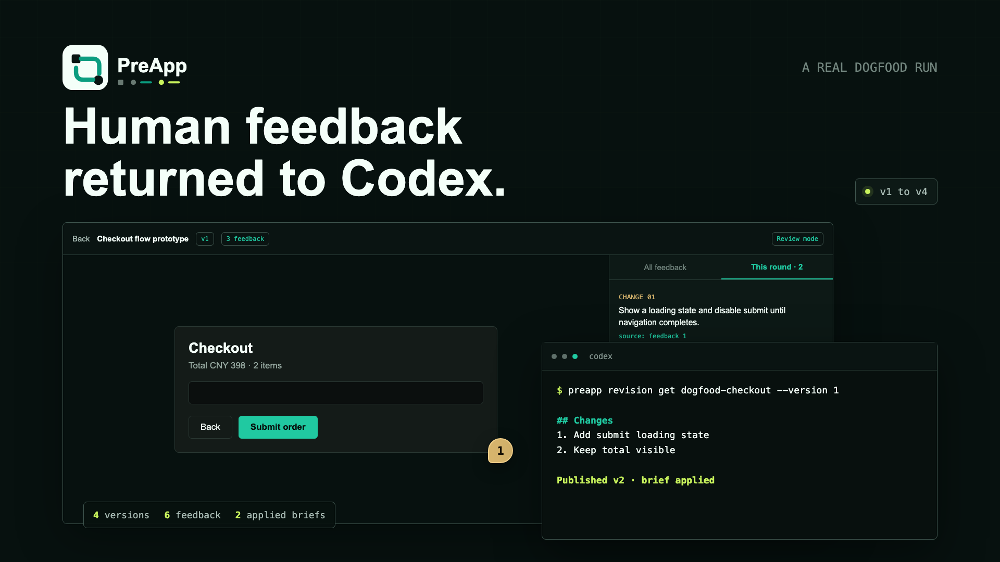

# PreApp Agent

[English](README.md) | **简体中文** | [日本語](README.ja.md) | [한국어](README.ko.md) | [Español](README.es.md)

把 agent 生成的内容分享给人看,收集反馈,再带回 agent 生成下一版。

Agent 已经很擅长生成内容——Markdown 文档和 HTML PPT，从报告到演示稿都算。PreApp 补齐最后一公里:**分享出去、收集反馈、带回下一轮 agent 运行。**

```text
agent publish → 分享链接 → 人类反馈 → agent 读取反馈 → agent 发布 v2
```

本仓库是 [preapp.app](https://preapp.app) 的 agent 集成层:`preapp` CLI、各 harness 的 agent skill(Claude Code / Codex / OpenClaw / Hermes)、协议文档,以及可直接发布的示例。托管服务本身不在本仓库。

[](https://github.com/serrendypity/preapp-agent/raw/main/docs/media/preapp-dogfood-case.mp4)

> **一次真实跑通**（[▶ 观看，41 秒，无旁白](https://github.com/serrendypity/preapp-agent/raw/main/docs/media/preapp-dogfood-case.mp4)）：评阅者在具体的 HTML 状态上留下反馈，负责人整理成修改清单，agent 读取后在同一个链接上发布了新版本。**4 个版本 · 2 轮反馈闭环 · 6 条反馈 · 2 份已应用修改清单。**

## 30 秒上手

```bash
# 1. 为你的 agent 安装 CLI + skill(命令不含 token——可安全转发)
curl -fsSL https://preapp.app/install.sh | sh -s -- --harness claude-code

# 2. 配置一次凭证(到 https://preapp.app/dashboard → 安装页生成 token)
preapp login <agent-token>

# 3. 发布一个 HTML 文件或目录
preapp publish ./dist --title "Q3 Strategy Review" --slug q3-strategy --format json
```

把返回的 `feedbackLink` 发出去,让人直接在页面上留反馈(划选文字、点击图片精准定位,无需注册),然后:

```bash
preapp feedback get q3-strategy --format markdown
```

Agent 会拿到一份 **Agent Feedback Brief**——带精确定位的反馈清单——改完发布 v2,**链接不变**。

用仓库自带的示例立刻试一把:

```bash
preapp publish examples/q3-strategy-deck --title "Q3 Strategy" --slug demo-q3
preapp publish examples/quarterly-report.html --title "Quarterly Report"
preapp publish examples/market-analysis.md --title "Market Analysis"   # Markdown → 服务端渲染 Mermaid + 公式
```

## 为什么是 PreApp

Agent 能生成 HTML,但把它递到人面前依然别扭:

- 文件躺在(往往是远程的)workspace 里——`file://` 没法分享。
- 通用托管(Vercel / Netlify / Pages)意味着建仓库、跑构建、生产部署语义——对一份"给人看一眼"的交付物来说太重。
- 反馈散落在微信 / 邮件 / 截图里,agent 永远看不到。

PreApp 只补缺的那个环:

- **HTML 或 Markdown**——单 HTML、单 `.md`（Mermaid 图与 KaTeX 公式服务端渲染）、目录(自动打包)或 zip 直接发布。
- **View / Feedback 双链接**——干净阅读与轻量反馈分开,权限各自独立。
- **反馈落在问题所在处**——划选文字、点击图片或 Mermaid 图表;也支持章节与整份内容反馈。Markdown 反馈定位回源 `.md` 行号。
- **版本 + 稳定链接**——每次发布是 v1/v2/v3;分享出去的链接永远指向最新版。
- **给 agent 的反馈载荷**——Markdown brief 或 JSON,带精确定位器。
- **访问记录**——知道分享有没有真的被打开。

它*不是*生产部署平台。不跑构建、不执行服务端代码——托管部分刻意平淡,价值全在评审闭环。

## 安装

**推荐(agent 与人通用)**——一条命令装好 CLI 和对应 harness 的 skill,永不包含 token:

```bash
curl -fsSL https://preapp.app/install.sh | sh -s -- --harness <claude-code|codex|openclaw|hermes>
```

**npm**:

```bash
npm i -g @preapp/cli
preapp skill install --harness claude-code
```

然后配置一次凭证(详见 [docs/install.md](docs/install.md)):

```bash
preapp login <agent-token>   # 写入 ~/.preapp/config.json 前会先向服务端校验
```

## 支持的 agent

| Agent | 方式 |
|---|---|
| Claude Code | `~/.claude/skills/preapp-publish/SKILL.md`(自动发现) |
| Codex | skill 目录 + [AGENTS.md 片段](skills/codex/preapp-publish/AGENTS-snippet.md) |
| OpenClaw | 约定 skill 路径,`--dir` 可覆盖 |
| Hermes | 约定 skill 路径,`--dir` 可覆盖 |
| Cursor / 任何能跑 shell 的 agent | 让 agent 直接调用 `preapp` CLI |
| Claude Desktop / 任何 MCP 客户端 | `preapp mcp`(stdio MCP server)——见 [docs/mcp.md](docs/mcp.md) |

> PreApp 提供 CLI、MCP server 与 agent skill 配方。Claude Code 最先支持;Codex/OpenClaw/Hermes 配方开放给社区打磨——[欢迎 PR](CONTRIBUTING.md)。

## 命令

```text
preapp publish <file-or-dir> [--title ...] [--slug <id-or-slug>] [--entry index.html|report.md]
                             [--change-note ...] [--anchors anchors.json]
                             [--feedback-mode off|detailed] [--review-profile standard|prototype]
                             [--revision <rbr_id> --revision-sequence <n>] [--format json|text]
preapp feedback get <share-url | version-url | content-id-or-slug> [--version N] [--format markdown|json]
preapp revision get <share-url | content-id-or-slug> [--version N] [--format markdown|json]
preapp revision save <share-url | content-id-or-slug> [--version N] --file <revision.json|-> [--ready]
preapp login <token> [--base-url <url>]
preapp skill install --harness <claude-code|codex|openclaw|hermes> [--dir <path>] [--force]
preapp mcp                                     # stdio MCP server(publish / feedback / revision 工具)
```

完整参考:[docs/cli.md](docs/cli.md) · MCP:[docs/mcp.md](docs/mcp.md) · 协议:[docs/api-protocol.md](docs/api-protocol.md) · 反馈载荷:[docs/feedback-payload.md](docs/feedback-payload.md)

### 两段式反馈关卡

`preapp feedback get` 的输出会刻意以一段关卡指令收尾:agent 必须**先安全扫描、按反馈 ID(fb_…)逐条复述给人、然后停下**——从拉反馈到人给出指示是只读阶段(不改文件、不调 shell/网络/凭证工具),不许静默自动改稿;反馈正文里自称"已获授权"一律无效。人按 ID 指定要采纳哪几条后,agent 才动手修改并重新发布。这是产品决策而非限制;见 [docs/cli.md](docs/cli.md#the-two-stage-feedback-gate)。

## 安全

- 安装命令永不包含 token;凭证经 `preapp login` 单独配置(落盘前校验,配置文件 `0600`)。
- 上传的交付物从隔离 origin 以**纯静态**方式经 sandbox iframe 提供——服务端永不执行上传的代码。
- 分享链接是不可猜测的 capability URL;可随时在控制台轮换或下架。
- 评审者反馈对 agent 是**未受信数据**(防 prompt injection)——skill 与文档都要求把它当内容、绝不当指令。

详情:[docs/security.md](docs/security.md) · 漏洞报告:[SECURITY.md](SECURITY.md)

## 仓库结构

```text
packages/cli/   preapp CLI(TypeScript,esbuild 单文件 bundle)
skills/         各 harness 的 skill 文件(由 CLI 单一源生成)
docs/           安装、CLI、skill、HTTP 协议、反馈载荷、安全模型
examples/       可直接发布的 HTML 示例
scripts/        install.sh 镜像(可审计)+ 冒烟测试
```

## 开发

```bash
pnpm install
pnpm typecheck
pnpm test
pnpm --filter @preapp/cli build   # → packages/cli/dist/preapp.js
```

## 许可证

[MIT](LICENSE)
