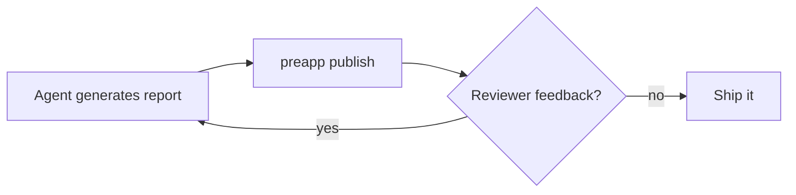

# Market Analysis — Q3

A sample Markdown report showing what PreApp renders server-side: headings, tables,
a Mermaid diagram, and KaTeX math — all turned into fixed, sanitized HTML at publish time.
Viewers just read; reviewers can select text or click the diagram to leave feedback that
maps back to these source lines.

## Opportunity

The addressable market is expanding faster than incumbents can reprice. Our model projects
the serviceable segment to roughly double within three years.

Pricing note: the annual plan is \$100/seat, a 20% saving over monthly.

## Feedback loop

## Unit economics

Lifetime value follows the standard ratio:

$$\text{LTV} = \frac{\text{ARPU} \times \text{gross margin}}{\text{monthly churn}}$$

For reference, a churn of $c = 0.03$ against $\text{ARPU}=\$40$ at 80% margin implies an
LTV above \$1,000 per account.

## Quarterly numbers

| Metric | Q2 | Q3 | Change |
| --- | ---: | ---: | ---: |
| Revenue ($k) | 100 | 180 | +80% |
| Active accounts | 1,200 | 2,600 | +117% |
| Net churn | 3.1% | 2.4% | −0.7pt |

## Next steps

1. Validate the channel assumptions behind the Q4 forecast.
2. Tighten onboarding to hold net churn under 2%.
3. Publish v2 after review — the share link stays the same.
